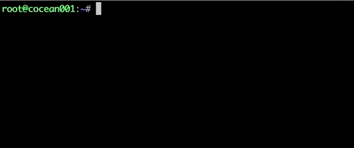
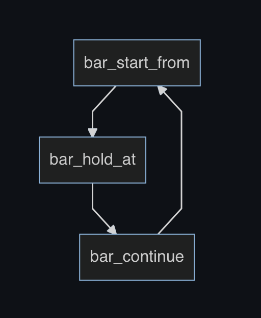

# Progress_Bar_Shell

## Background

### About the script

When writing a one-click installation and deployment script with **shell**, I found difficult to grasp the real-time progress of the deployment. Which means I could only guess the status of current progress based on my roughly remained impression of the script. If I have a controllable progress bar in my script, it would be clear to me of how many happy coffee time I still have.

After seen many progress bars written in different languages such as python and go, I realized that there are very few progress bars written in shell, let alone controllable ones. So the idea of writing a controllable progress bar was born.

### Preview


Combined with your shell script (customized style):



## Function

### Custom Progress

- Stay at a desired progress:

  For instance, stays at 25%

  

- Start from a preset progress:

  set starts from 30% and holds at 50%: 

  

### Asynchronous operation (child process)

This scrpit does not conflict with other processes and runs synchronously.

### Rotating pointer

On the basis of the progress bar, I added a cycle of rotation pointer can be used to confirm the current status of the program is **running** or stuck in where.


PS:  The pointer is actually a while loop, it can be also customized into other styles for traversal.


The script is relatively simple, with few functions, just use it:)

If possible, please correct me!

## Usage

### 1）Download

```
wget https://github.com/Cocean001/progress_bar_shell/blob/main/progress_bar_shell.sh && chmod +x progress_bar_shell.sh
```


### 2）Source to your own script

You can copy and paste directly, or quote through the source in the file:

```
source /path/to/your/progress_bar_shell.sh
```

Notes: Replace **/path/to/your** with the file path


### 3）Instructions for use

A) There are 3 control characters in the script to control different functions:

- **bar_start_from** : Used to control the percentage of the start of the progress.

  Format:

  ```shell
  bar_start_from [starting progress value (no need to add a percent sign)]
  ```

  Example 1: Starting from 15%

  ```shell
  bar_start_from 15
  ```

  

  Example 2: Start at 50%

  ```
  bar_start_from 50
  ```

  

  

- **bar_hold_at** : set the waiting position of the progress bar

  Format:

  ```shell
  bar_hold_at [custom percentage of progress bar（no need to add percent sign）] "customised content here" &
  # Notes:
  # 1）If asynchronous progress is needed, then add "&" at the end
  # 2）If set: bar_hold_at 100, the progress bar will be terminated
  ```

  Example 1: Holds at 30%

  ```shell
  bar_hold_at 30 "here we hold at 30%" &
  ```

  

  Example 2: Holds at 75%

  ```shell
  bar_hold_at 75 "here we hold at 75%" &
  ```

  

- **bar_continue** : Terminate the previous hold and continue the progress. Format:

  ```shell
  bar_continue
  ```


B) The order of usage (logical) is:

bar_start_from -> bar_hold_at -> bar_continue ：



4）Examples

Set default: There are currently custom functions **do_something** and **more_things**

```shell
function do_something(){
    echo "---this is do_something---"
    echo "here is your progress"
    sleep 1s # non-essential
}

function more_things(){
		echo "---this is more_things---"
		echo "you could also add"
		echo "more command with it"
		sleep 1s # non-essential
}
```


Example 1: Starting from **0%** , execute **do_something** , and let the progress bar stays at **50%**

```shell
bar_start_from 0
bar_hold_at 50 "here hold at 50%" & 
do_something
# Do place bar_hold_at before do_something, and add "&" to do asynchronous processing (the child process)
```


Example 2: Starting from 50%, execute **more_things** , let the progress bar runs to 100%, then exit.

```shell
bar_start_from 50
bar_hold_at 100 "running" &
more_things
```


Example 3: Example 1 & Example 2 

( 0-50% : **do_something** ; 50%-100%: **more_things** )

```shell
bar_start_from 0
bar_hold_at 50 "here hold at 50%" &
do_something

bar_continue # to terminate the previous process (0-50%)

bar_start_from 50
bar_hold_at 100 "running" &
more_things
```


If there is a progress that needs to be connected before and after, use **bar_continue** to end the previous progress first.

### 4）Other

- The current accuracy is 5%, and the classification is 5% upward. For instance:

  - Input the value 53, it will be regarded as input 55;
  - Input the value 62, it will be regarded as input 65;
  - Input the value 86, it will be regarded as input 90;
- and so on.
- The script does not support decimal points at the moment.


## Reference

Here is a reference to  [haikieu/shell-progressbar](https://github.com/haikieu/shell-progressbar)，thanx for the development!


## License

Apache 2.0
