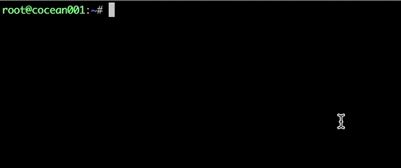
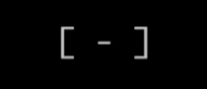
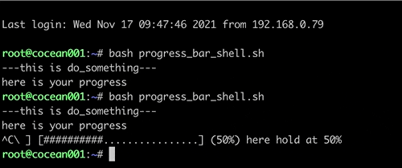
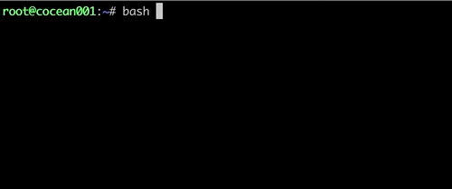

# Progress_Bar_Shell

## 关于该脚本

### 前言

在用shell写一键安装部署脚本时，发现无法掌握部署的实时进度，只能根据脑海里大致残存的对脚本的印象来判断现在程序的进度和状态。如果有个进度条，就可以清晰告知我现在还有多久happy coffee time了。

看到很多用python、go等语言写的进度条，但shell的进度条寥寥无几，可控的也几乎没有。因此诞生出想写一个可控进度条的想法。

### 预览



脚本风格自定义示例：


## 实现功能

### 自定义进度

- 停留在某个想要的进度：

  例：停留在25%：

  

- 从某个预设的进度开始：

  例：从30%开始，停留在50%

  

### 异步运行（子进程）

与其他进程不冲突，同步运行。

### 旋转指针

在可控进度条的基础上加了一个循环的旋转指针，可以用来确认当前程序的状态，是 **正在运行** 还是卡在了哪里。



PS：因为左侧的指针是个循环，所以指针可以自定义成其他的样式做遍历。

脚本比较简单，功能不多，能用就行。代码水平不高，欢迎指正！


## 使用

### 1）下载

```
wget https://github.com/Cocean001/progress_bar_shell/blob/main/progress_bar_shell.sh && chmod +x progress_bar_shell.sh
```


### 2）引用到自己的脚本

可以直接复制粘贴，或通过文件内source引用：

```
source /path/to/your/progress_bar_shell.sh
```

注：将 **/path/to/your** 替换成文件路径


### 3）使用说明

A) 脚本内有3个控制符，用来控制不同功能：

- **bar_start_from**：用于控制进度开始的百分比。

  格式：

  ```shell
  bar_start_from [开始的进度数值（无需加百分号)]
  ```

  示例1：从15%开始

  ```shell
  bar_start_from 15
  ```

  

  示例2：从50%开始

  ```
  bar_start_from 50
  ```

  

  

- **bar_hold_at**：设定进度条等待的位置

  格式：

  ```shell
  bar_hold_at [设定进度条在哪里等待（不用加百分号）] "customised content here" &
  # 注：
  # 1）末尾的"&"如果是异步的话就要加，不是异步就无需添加。
  # 2）如果是bar_hold_at 100，就会自动终止进度条。
  ```

  示例1：在30%处等待

  ```shell
  bar_hold_at 30 "here we hold at 30%" &
  ```

  

  示例2：在75%处等待

  ```shell
  bar_hold_at 75 "here we hold at 75%" &
  ```

  

- **bar_continue**：终止hold，继续进度。格式：

  ```shell
  bar_continue
  ```


B) 使用顺序（逻辑）为：

bar_start_from -> bar_hold_at -> bar_continue ：


4）使用示例

例：当前有自定义function **do_something** 和 **more_things**

```shell
function do_something(){
    echo "---this is do_something---"
    echo "here is your progress"
    sleep 1s #非必须项
}

function more_things(){
		echo "---this is more_things---"
		echo "you could also add"
		echo "more command with it"
		sleep 1s #非必须项
}
```


示例1：从 **0%** 开始，执行 **do_something** ，进度条停留在 **50%**

```shell
bar_start_from 0
bar_hold_at 50 "here hold at 50%" & 
do_something

# 注：bar_hold_at 要在do_something前运行，且要加"&"做异步处理（子进程）
```



示例2：从50%开始，执行 **more_things** ，进度条跑到100%并结束

```shell
bar_start_from 50
bar_hold_at 100 "running" &
more_things
```



示例3：示例1+示例2（0-50%：**do_something**；50%-100%：**more_things**）

```shell
bar_start_from 0
bar_hold_at 50 "here hold at 50%" &
do_something

bar_continue #用于结束上一个进度，开始下一个进度

bar_start_from 50
bar_hold_at 100 "running" &
more_things
```


如果有前后进度需要衔接，要用 **bar_continue** 先结束上一个进度。

### 4）其他

- 当前精度到5%，且以5%向上归类。如：

  - 输入数值53，将视为输入55；

  - 输入数值62，将视为输入65；

  - 输入数值86，将视为输入90；
  - 以此类推。

- 该脚本暂不支持小数点。


## 引用参考

此处参考了  [haikieu/shell-progressbar](https://github.com/haikieu/shell-progressbar)，感谢大佬开发。


## 开源协议

Apache 2.0
